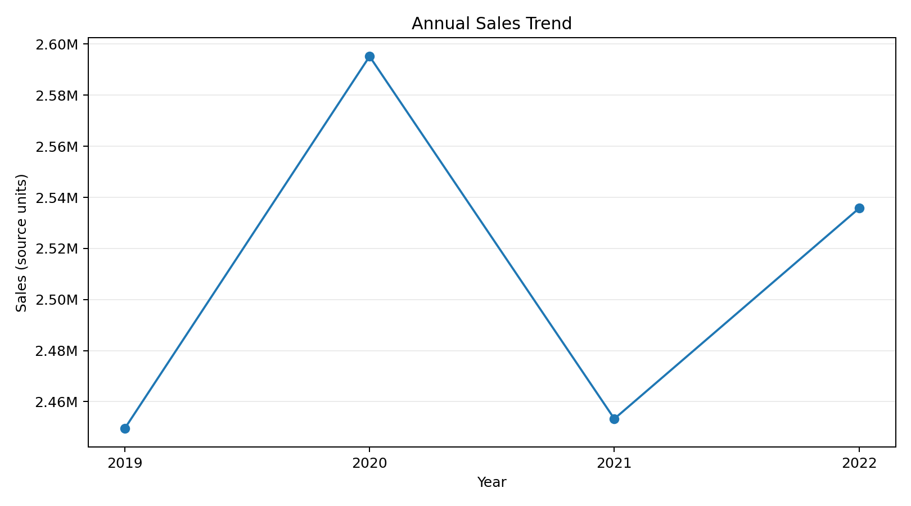
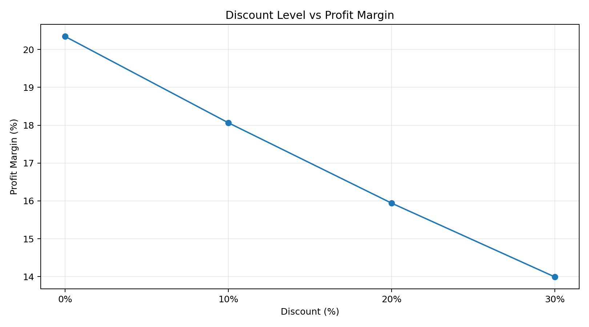

# Python Retail Sales Analysis Pipeline

A portfolio-ready **Python data analysis project** that turns 10,000 retail transaction records into validated, analysis-ready data, reusable summary tables and business-focused visualizations.

## Project objective

The project answers practical questions around sales performance, profitability, regional/category contribution, shipping performance and discount behavior while demonstrating a reproducible Python workflow rather than a one-off notebook.

## Tech stack

- Python
- pandas
- NumPy
- Matplotlib
- Jupyter Notebook

## Project workflow

```text
Raw CSV
   ↓
Data validation
   ↓
Cleaning & type checks
   ↓
Feature engineering
   ↓
KPI calculation
   ↓
EDA / grouped analysis
   ↓
Charts + summary tables
   ↓
Processed dataset
```

## Repository structure

```text
Python_Sales_Analysis_Professional/
├── README.md
├── run_analysis.py
├── requirements.txt
├── data/
│   ├── raw/sales_orders.csv
│   └── processed/clean_sales_orders.csv
├── src/
│   └── sales_analysis.py
├── notebooks/
│   └── sales_analysis.ipynb
├── outputs/
│   ├── charts/
│   └── tables/
└── docs/
    ├── data_dictionary.md
    └── methodology.md
```

## Data quality checks

The supplied snapshot contains:

- **10,000** rows
- **0** duplicate rows
- **0** missing source cells
- **0** ship-before-order records
- **79** negative-profit orders retained for analysis
- **10,000** unique Order IDs

Negative profit is treated as a valid business outcome rather than automatically removed.

## Core KPIs

| KPI | Result |
|---|---:|
| Total Sales | 10,033,715.95 source units |
| Total Profit | 1,711,180.34 source units |
| Overall Profit Margin | 17.05% |
| Orders | 10,000 |
| Units Sold | 54,823 |
| Average Order Value | 1,003.37 source units |

## Key findings

1. **2022 sales reached 2.54M**, up **3.36% YoY** from 2021.
2. **Furniture** generated the highest category sales (~3.40M), while **Technology** had the strongest category margin (~17.21%).
3. **East** generated the highest regional sales (~3.39M), while **West** delivered the highest regional margin (~17.17%).
4. Aggregate profit margin falls from **20.35% at 0% discount** to **13.99% at 30% discount**.
5. The discount result is **descriptive association, not causal proof**. Product mix or other factors may also affect profitability.


## Sample visual outputs

### Annual sales trend


### Discount level vs profit margin


## Example Python techniques demonstrated

```python
df.groupby("region").agg(
    sales=("sales", "sum"),
    profit=("profit", "sum")
)
```

```python
yearly["yoy_sales_growth_pct"] = yearly["sales"].pct_change() * 100
```

```python
df["shipping_days"] = (
    df["ship_date"] - df["order_date"]
).dt.days
```

The reusable functions are in `src/sales_analysis.py` and the full analysis can be rerun with:

```bash
pip install -r requirements.txt
python run_analysis.py
```

## Important dataset limitations

- Source currency is not documented, so monetary values are reported as **source units**.
- Every customer ID and product ID is unique in this practice dataset. The project therefore does **not** make repeat-purchase, retention or true SKU-level claims.
- Findings describe this dataset and should not be interpreted as causal effects without additional analysis.

## Portfolio value

This project demonstrates that I can move beyond isolated pandas commands and build a repeatable workflow for **data validation, transformation, KPI calculation, exploratory analysis, visualization and reporting**.
